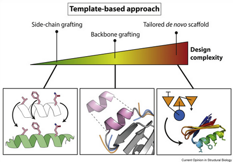

<p align="center">
  
</p>

# 🌱 Rosetta Motif Grafting Tutorial — For Dummies | 教程：Rosetta 模体嫁接 | Tutorial para Iniciantes
---
## 👩‍🔬 Sobre o que é este tutorial? | What's this about? | 本教程介绍内容

Este tutorial ensina a realizar enxertos de motivos funcionais (motif grafting) usando o Rosetta, cobrindo tanto os métodos de Side Chain Grafting quanto Backbone Grafting. É ideal para quem deseja entender e aplicar modelagem estrutural racional em bioengenharia de proteínas — como ilustrado na imagem abaixo.
This tutorial teaches how to perform functional motif grafting using Rosetta, covering both Side Chain Grafting and Backbone Grafting methods. It's perfect for those aiming to understand and apply rational structural modeling in protein bioengineering — as shown in the image below.
本教程介绍如何使用 Rosetta 进行功能模体嫁接，涵盖 侧链嫁接 和 主链嫁接 两种方法。适合希望了解并应用蛋白质生物工程中结构建模方法的用户 —— 如下图所示。

<p align="center">
  
</p>

---
## 🧰 Requirements | Requisitos | 要求

- ✅ Rosetta properly installed
- ✅ Terminal Linux experience
- ✅ Motif, scaffold and context `PDB` files
- ✅ Understanding of protein structure (basic)
- ✅ Rosetta instalado e funcional
- ✅ Acesso a scaffolds (`.pdb`)
- ✅ Arquivos `motif.pdb` e context.pdb
- ✅ Conhecimento básico de terminal Linux

---
## 🗂️ Folder Structure | Estrutura de Pastas | 文件结构

```bash
rosetta/scaffolding/
├── SideChainGraft/
│   ├── input_files/
│   ├── scripts/
│   └── my_files/           # Aqui você executa seu código
├── BackboneGraft/
│   ├── input_files/
│   ├── scripts/
│   └── my_files/           # Aqui você executa seu código
└── RosettaRemodel/
    ├── input_files/
    ├── scripts/
    └── my_files/
```
---

### 🔧 Etapas principais | Key Steps | 主要步骤

- 1. Definir o motivo (motif) da interação. (LXXLL, por exemplo)
- 2. Preparar um banco de estruturas scaffold.
- 3. Rodar o Rosetta para procurar onde encaixar o motivo.
- 4. Projetar a sequência ao redor do motivo.
- 5. Refinar e validar os modelos gerados.

---

## 🌟 Parte 1: Side Chain Grafting | 侧链嫁接 | Enxerto de Cadeia Lateral

### 📌 Quando usar:

- Quando a estrutura do motivo e do scaffold são muito parecidas.
- Ideal para mudanças pequenas com alta chance de sucesso.

### ✅ Vantagens:🔧 Etapas principais | Key Steps | 主要步骤

- 1. Definir o motivo (motif) da interação. (LXXLL, por exemplo)
- 2. Preparar um banco de estruturas scaffold.
- 3. Rodar o Rosetta para procurar onde encaixar o motivo.
- 4. Projetar a sequência ao redor do motivo.
- 5. Refinar e validar os modelos gerados.

---
Poucas mutações, maior estabilidade.

### ❌ Limitações:

Só funciona se os backbones se sobrepõem com **RMSD < 0.5 Å**.

### 📁 Comandos principais:
```bash
cd ~/rosetta/scaffolding/SideChainGraft/
mkdir my_files && cd my_files
cp ../input_files/context.pdb .
cp ../input_files/motif.pdb .
ls ../scaffolds/*.pdb > scaffolds.list
cp ../scripts/MotifGraft_sc.xml .

~/rosetta/main/source/bin/rosetta_scripts.linuxgccrelease \
  -l scaffolds.list -parser:protocol MotifGraft_sc.xml \
  -nstruct 1 -use_input_sc -ex1 -ex2
```
---

### 🧾 Entendendo o Arquivo `XML` do Rosetta | Understanding Rosetta `XML` | 理解 Rosetta `XML` 文件
O arquivo `MotifGraft_sc.xml` é o coração do protocolo Rosetta. Ele define o que o Rosetta fará com seus arquivos `PDB`, como o enxerto do motivo (motif) no scaffold, o refinamento da estrutura e a aplicação de filtros de qualidade.

⚠️ **Este é o arquivo que você passa no comando **`-parser:protocol quando roda o rosetta_scripts.`
🧱 Estrutura do `XML` em partes |`XML` Sections | `XML` 结构划分
🛠️ TASKOPERATIONS:
Define o que será redesenhado ou apenas empacotado (repacked).
```bash
<ProteinInterfaceDesign name="pido" repack_chain1="1" repack_chain2="1" design_chain1="0" design_chain2="1" interface_distance_cutoff="8.0"/>
```
📌 Resumo: Só a cadeia 2 será redesenhada. Cadeia 1 apenas empacotada.
🧪 FILTERS:
Usados para avaliar a qualidade do enxerto.
```bash
<Ddg name="ddg"/>
<BuriedUnsatHbonds name="unsat"/>
<ShapeComplementarity name="Sc"/>
```
✅ Você só quer modelos bons, então:
- **ddG**: Avalia energia de ligação.
- **unsat**: Verifica H-bonds não satisfeitos.
- **Sc**: Mede se os encaixes são "bonitos".

🔧 MOVERS:
Ações que o Rosetta executa em sequência.
```bash
<MotifGraft name="motif_grafting" context_structure="context.pdb" motif_structure="motif.pdb" ... />
```
🌟 Esse é o passo central: colocar o motivo na estrutura do scaffold.
🧩 PROTOCOLS:
Define a ordem dos passos (executados como um roteiro).
```bash
<Add mover_name="motif_grafting"/>
<Add mover_name="ala_pose"/>
<Add mover_name="ppk"/>
<Add mover_name="design"/>
<Add mover_name="rb_min"/>
<Add filter_name="unsat"/>
<Add filter_name="ddg"/>
<Add filter_name="Sc"/>
```
🎯 Essa sequência garante que o motivo será enxertado, refinado e validado!

---
## 🧠 Parte 2: Backbone Grafting | 主链嫁接 | Enxerto de Cadeia Principal

📌 Quando usar:
- Quando a estrutura do motivo e do scaffold são diferentes.
- Ideal para loops e segmentos inteiros.
✅ Vantagens:
- Permite inserir regiões com nova estrutura.
❌ Limitações
- Mais mutações = menor chance de estabilidade.

### 📁 Comandos principais:
```bash
cd ~/rosetta/scaffolding/BackboneGraft/
mkdir my_files && cd my_files
cp ../input_files/context.pdb .
cp ../input_files/motif.pdb .
ls ../scaffolds/*.pdb > scaffolds.list
cp ../scripts/MotifGraft_bb.xml .

~/rosetta/main/source/bin/rosetta_scripts.linuxgccrelease \
  -l scaffolds.list -parser:protocol MotifGraft_bb.xml \
  -nstruct 1 -use_input_sc
```
  ---

## 🧪 Parte 3: Avaliação e Refinamento | 评估与优化 | Avaliação e Refino

Filtrar por qualidade da interface:

- Binding energy (**ddG < 0**),
- Complementaridade (**Sc > 0.65**)
- Baixo número de H-bonds insatisfeitos

Inspeção manual:

- Verifique se há resíduos enterrados com carga.
- Evite interfaces dominadas por alanina.

Reverter para o nativo:

- Reduza mutações revertendo posições não essenciais para o estado original.
- Comparação de RMSD com a estrutura original.
- Gerar logotipo de sequência (WebLogo) ou alinhamento.

### 🎯 Interpretação de Resultados | Result Interpretation | 结果解读

No final do tutorial original, são apresentados critérios adicionais para avaliar se seu modelo gerado é confiável. O tutorial PDF sugere:

- Comparar seus resultados com estruturas de referência (nativas)
- Realizar clustering para identificar conformações estáveis
- Usar análises visuais com `PyMOL`
- Gerar scoreplots e gráficos para entender o impacto de cada mutação

❓ Precisa de ajuda para interpretar seus resultados?
📩 Entre em contato comigo!

---
## 🧰 Parte 4: Rosetta Remodel (Opcional) | Rosetta Remodel (Optional) | Rosetta Remodel（可选）

Usado para modificar interações locais sem trocar completamente estruturas. Exemplo: melhorar contatos do motivo com o alvo.
Used to fine-tune local interactions without fully replacing structures. Example: improving motif-target contacts.
用于局部结构优化，而不是完全替换。示例：增强模体与靶点之间的相互作用。

### 🛠️ Etapas | Steps | 步骤

Prepare os arquivos `.blueprint` e `.resfile` para indicar as regiões a serem modificadas.
Use o protocolo `remodel.xml` (pode ser incluído na pasta scripts do seu projeto).

Execute com o seguinte comando:
```bash
~/rosetta/main/source/bin/rosetta_scripts.linuxgccrelease \
  -parser:protocol remodel.xml \
  -s seu_modelo.pdb \
  -use_input_sc -ex1 -ex2
```
### 📤 Saída esperada | Output | 输出

Estruturas otimizadas com novas conformações locais.
Melhor energia de interação local.
🔎 Ideal para: ajustar loops, interfaces de ligação ou áreas flexíveis.

🗂️ Modelo Genérico de Execução (Resumo) | General Execution Summary | 执行步骤概览
```bash
# Relaxar estruturas
relax.static.linuxgccrelease -s seu_scaffold.pdb -out:prefix rlx_

# Preparar o contexto e motif
score_jd2.static.linuxgccrelease -s context.pdb motif.pdb -ignore_unrecognized_res -out:pdb

# Gerar lista de scaffolds
ls scaffolds/*pdb > scaffolds.list

# Rodar MotifGraft com protocolo `XML` (Side Chain ou Backbone)
rosetta_scripts.static.linuxgccrelease \
  -parser:protocol MotifGraft.xml \
  -l scaffolds.list -use_input_sc -nstruct 1 -ex1 -ex2

# Reverter mutações (opcional)
revert_design_to_native.static.linuxgccrelease \
  -revert_app:wt complexo_nativo.pdb \
  -revert_app:design estrutura_projetada.pdb -ex1 -ex2 -use_input_sc
```
## 📚 Referências | References | 参考文献

- Cao, L. et al. (2020) Science, 370, 426–431.
- Silva, D.-A., Correia, B. E. & Procko, E. (2016). Motif-Driven Design of Protein–Protein Interfaces. Methods Mol. Biol.
- Alford, R. F. et al. (2017). The Rosetta All-Atom Energy Function for Macromolecular Modeling and Design. J. Chem. Theory Comput.
- RosettaCommons Docs: https://www.rosettacommons.org
- Tutorial ProteinDesign.pdf & Tutorial_ProteinDesign.docx (Material de apoio original)


